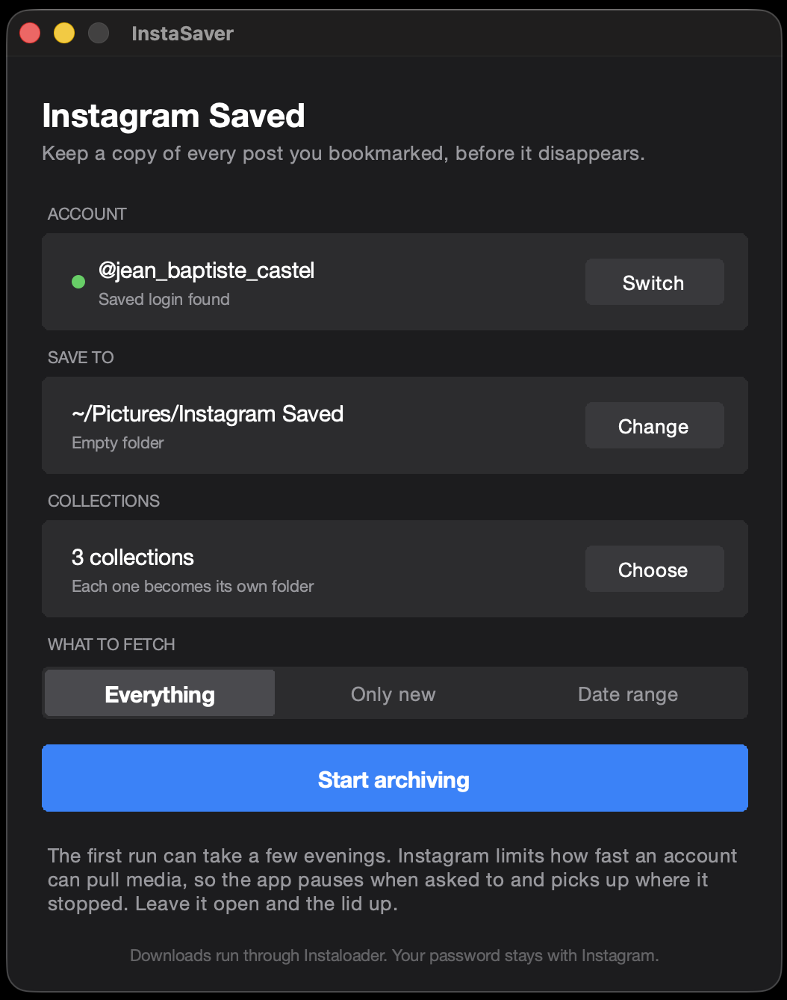

# InstaSaver

**Download every Instagram post you ever saved, in bulk, with your saved collections
mirrored as folders on your computer.** Free, no account, no upsell. macOS and Windows.



Instagram saves are a reference library that quietly rots. People delete posts, archive
them, or make their account private, and the save stays in your list pointing at nothing.
InstaSaver keeps a copy before that happens, and tells you how much is already gone.

## What it does

- Bulk downloads everything in your Instagram saved list, thousands of posts in one run
- Mirrors your saved collections as folders, one folder per collection
- Shows, per collection, how many posts are still recoverable and how many are already
  deleted or archived
- Survives Instagram's rate limiting. It pauses, explains why, and resumes on its own,
  backing off 20 minutes, then 45, 90, three hours, up to twelve
- Picks an interrupted run back up where it stopped
- Signs in with the Instagram session already in your browser, so it never asks for your
  password and never sees it
- Media only, no metadata files cluttering the folder
- Three modes: everything, only what is new since the last run, or a date range

## Download

| File | For |
| --- | --- |
| `InstaSaver-1.1-macOS-AppleSilicon.dmg` | Macs with an M1, M2, M3 or M4 chip |
| `InstaSaver-1.1-macOS-Intel.dmg` | Macs with an Intel processor |
| `InstaSaver-1.1-Windows.exe` | Windows 10 and 11 |

**[Get the latest release](../../releases/latest)**

Not sure which Mac you have: Apple menu, About This Mac. If it says *Chip*, take Apple
silicon. If it says *Processor*, take Intel.

### First launch on macOS

The app is not signed with a paid Apple certificate, so macOS shows a panel saying it
cannot verify the developer. Press **Done**, not Move to Bin, then open **System
Settings**, **Privacy and Security**, scroll to the bottom and press **Open Anyway**.
You do this once.

### First launch on Windows

Windows SmartScreen shows a blue panel because the file is new and unsigned. Press
**More info**, then **Run anyway**. You do this once.

## How it works

InstaSaver wraps [Instaloader](https://github.com/instaloader/instaloader), which does
the downloading, and adds three things on top: a supervisor that handles rate limiting
instead of dying at it, an interface for people who do not use a terminal, and support
for saved collections, which Instaloader does not have.

Login uses [browser_cookie3](https://github.com/borisbabic/browser_cookie3) to read the
Instagram session already sitting in Chrome, Safari, Firefox, Brave, Edge, Arc, Opera or
Vivaldi. No password is typed, stored, or sent anywhere.

## Saved collections, and why no other tool had them

If you have looked for this before, you have probably found
[Instaloader issue #544](https://github.com/instaloader/instaloader/issues/544), open
since 2020, or one of the threads where somebody tried to find the query hash and gave
up. Here is the whole answer, in case you want to build it yourself.

`api/v1/collections/list/` is a phone app path. On the web host it is not served as JSON
at all, you get the app shell HTML back, which is what makes it look like the endpoint
does not exist. What the Instagram web app actually does is POST to
`www.instagram.com/api/graphql` with a `doc_id`:

| doc_id | Returns |
| --- | --- |
| `27959320833754327` | The collection list: `collection_id`, `collection_name`, `collection_media_count` |
| `28281867904811986` | The posts in one collection, paged with `first` and `after` |

The part that costs people days: the request needs the browser's `Sec-Fetch-Site`,
`Sec-Fetch-Mode` and `Sec-Fetch-Dest` headers. Without them Instagram reads the POST as a
page visit and answers with HTML rather than running the query, so it looks like a dead
endpoint rather than a rejected request. It also needs `fb_dtsg`, which you can read off
any logged in page. Session cookies alone are not enough.

The media dicts that come back carry no `taken_at`, so they cannot go through
`Post.from_iphone_struct`. InstaSaver takes the shortcode out of each one and hands it to
`Post.from_shortcode`, which keeps dates, videos and carousels working like everywhere
else.

Instagram's own count includes posts it will no longer serve, which is where the
"12 recoverable, 8 deleted or archived" line comes from. The gap is real, and it is the
reason to keep a copy.

## Privacy

Everything happens on your machine. There is no account, no server, no analytics, and
nothing is uploaded anywhere. The app reads one thing, the Instagram session cookie
already in your browser, and writes files into the folder you choose.

## Limits, honestly

- Instagram does not allow automated downloading. Pulling a large library can get an
  account temporarily rate limited. The app backs off rather than pushing through, which
  is the careful way to do a thing that still carries some risk.
- It sits on an interface Instagram changes without notice. It may break. When it does,
  open an issue and it gets fixed, but no promises about a specific week.
- It archives your own saves. It is not a bulk scraper for other people's accounts.

## Build it yourself

```bash
git clone https://github.com/YOUR_USERNAME/instasaver.git
cd instasaver
pip install -r requirements.txt pyinstaller
pyinstaller --noconfirm --clean InstaSaver.spec           # macOS, makes dist/InstaSaver.app
pyinstaller --noconfirm --clean InstaSaver-windows.spec   # Windows, makes dist/InstaSaver.exe
```

Or run it straight from the source with `python3 InstaSaver.py`. It needs Python 3.9 or
newer with Tk 8.6 or newer, which the python.org installers have and the Python built
into macOS does not.

The three release files are built by GitHub Actions on every tag, one macOS Apple
silicon, one macOS Intel, one Windows. See `.github/workflows/build.yml`.

## Credits

Built on [Instaloader](https://github.com/instaloader/instaloader) by the Instaloader
authors, which does the actual downloading and the rate limit primitives. Not affiliated
with them, and not affiliated with Instagram or Meta.

Made by [Gast Studio](https://www.gast.studio/instasaver).

## License

MIT. See [LICENSE](LICENSE).
